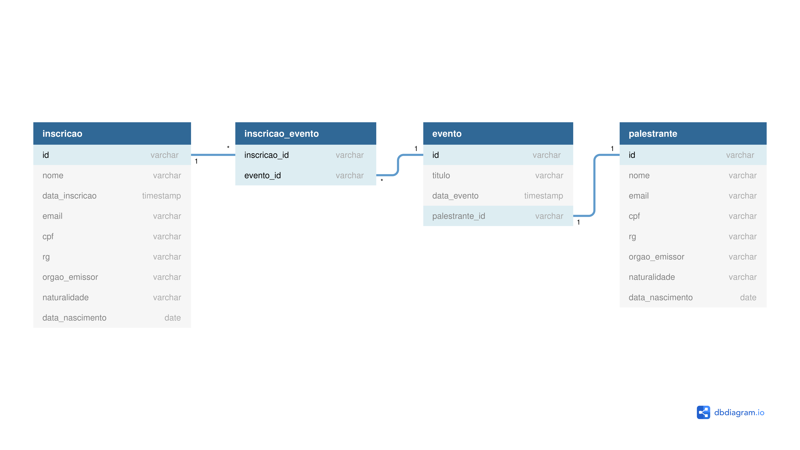

# if-maker

## Sumário

- [if-maker](#if-maker)
  - [Sumário](#sumário)
  - [Motivação](#motivação)
  - [Pilha de tecnologia](#pilha-de-tecnologia)
  - [Galeria](#galeria)

## Motivação

Este foi o único repositório de código apresentado no [Curso Técnico Integrado em Informática do IFMS](https://www.ifms.edu.br/campi/campus-aquidauana/cursos/integrado/informatica) como requisito para obtenção da nota parcial de uma atividade da unidade curricular Desenvolvimento Web II, a qual consistiu em refatorar a antiga página da rede de laboratórios IF Maker. 

## Pilha de tecnologia

As seguintes tecnologias foram utilizadas para desenvolver este app:

| Papel | Tecnologia |
|-|-|
| Ambiente de execução | [XAMPP](https://www.apachefriends.org/pt_br/about.html) |
| Linguagem de programação | [PHP](https://www.php.net/) |
| Banco de dados | [MySQL](https://maven.apache.org/) |

## Galeria

